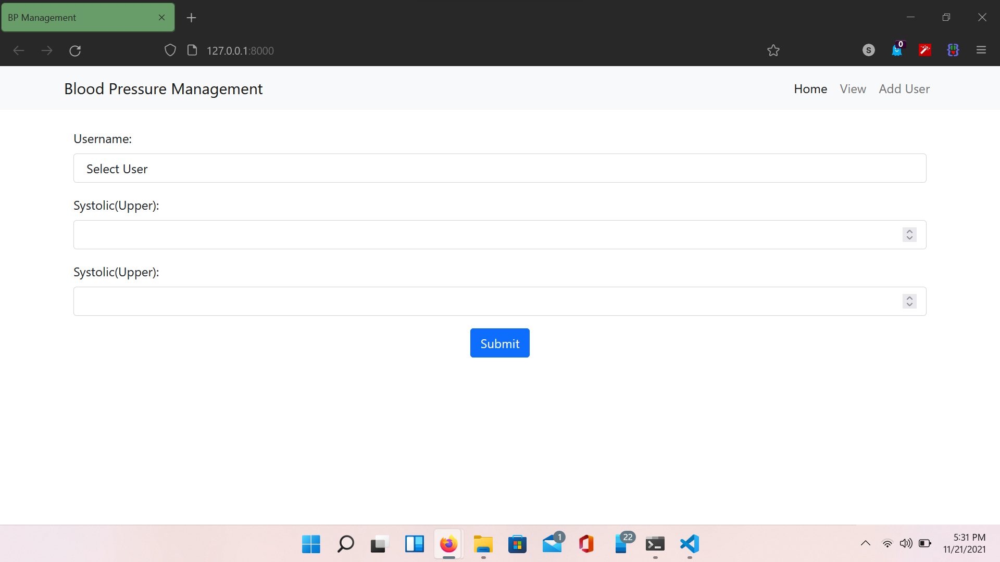
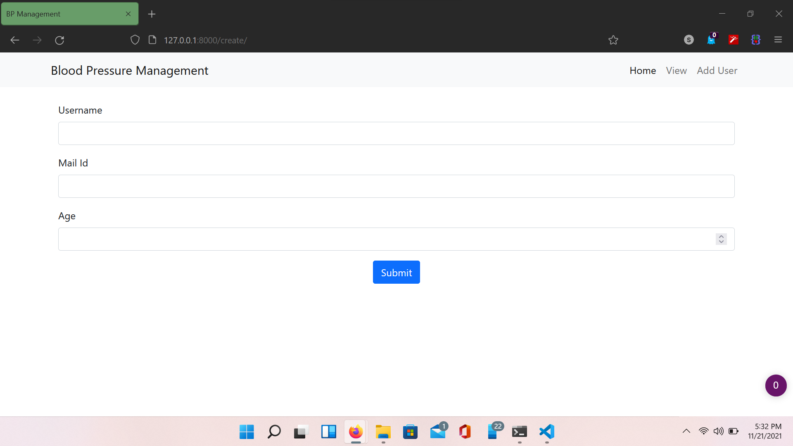
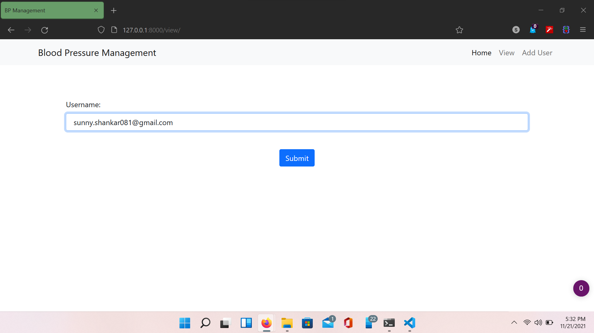
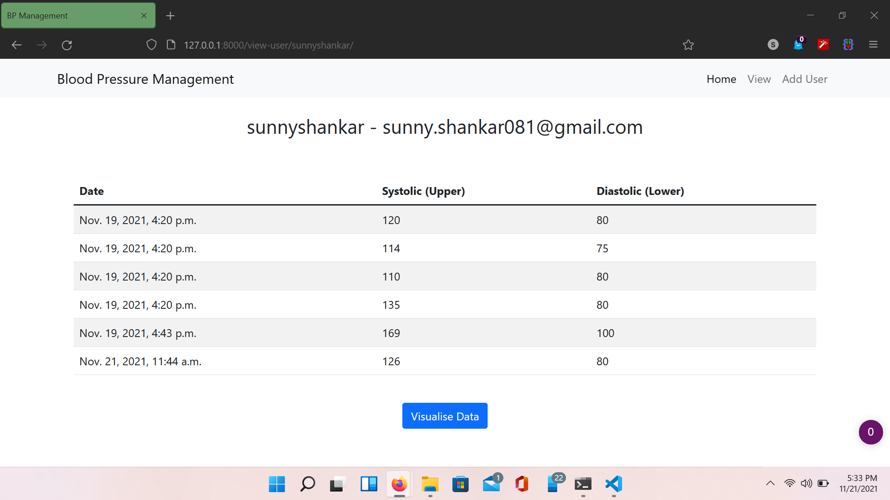
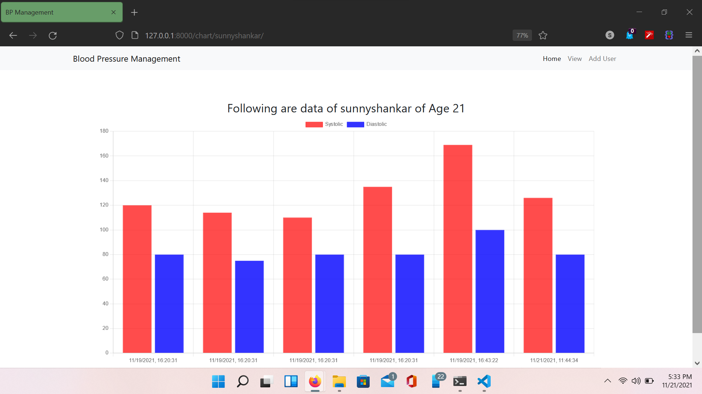

# Blood Pressure Management Web Application

A Minimal Blood Pressure Management Web Application using Django

Frontend: HTML, CSS, JS ,Bootstrap and Chart.js
Backend: Django

## Installation

```
# clone project
git clone https://github.com/sny-shnkr/bp-management.git

# change into project folder
cd bp-management/

# install requirements
pip install -r requirements.txt

# make migration 
python manage.py makemigrations
python manage.py migrate

# run application
python manage.py runserver
```

## Screenshot

Home Page



Add User Page



View Data Page





Bar Graph of User Date

